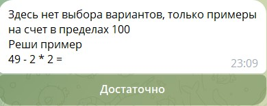

# Математический бот

Это телеграм-бот на библиотеке aiogram_dialog

В нем дети могут тренировать таблицу умножения и счет в пределах ста.

Бот предлагает решать примеры

Пользователь может получить статистику за определеные периоды времени

## Сам бот доступен по ссылке
[Математический тренажер]( https://t.me/Kids_simple_math_bot)
